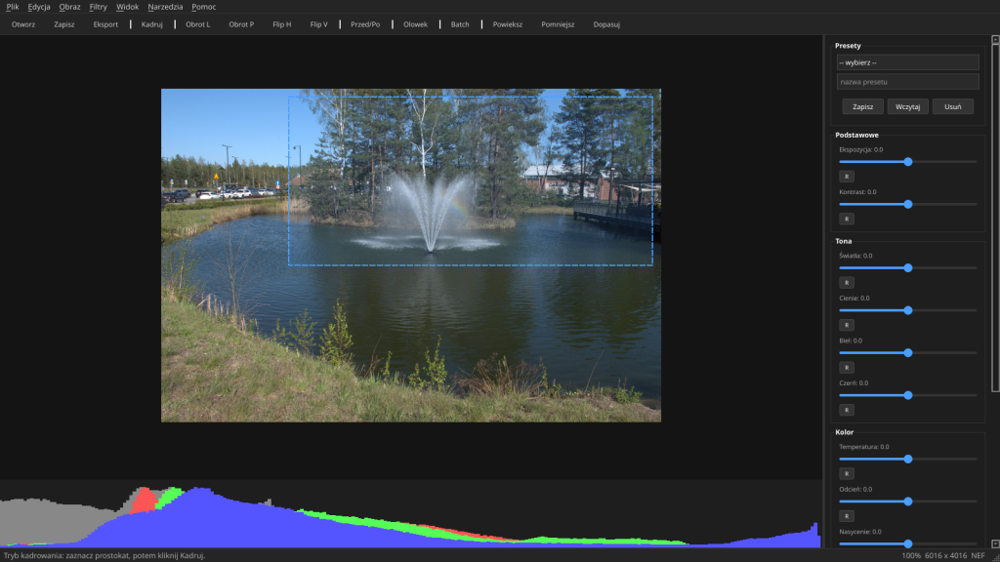
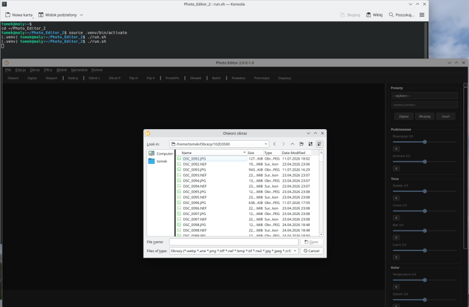

# Photo Editor 2.0

A desktop photo editor for Linux, written in **Python** and **PySide6 (Qt)**.
Solo project, in active development — current version: **0.1.0**.



## Features

- **RAW support** (NEF, CR2, CR3, ARW, DNG, ORF, RW2, RAF, PEF via rawpy) as well as JPEG, PNG, TIFF, BMP, WebP
- **Adjustments**: exposure, contrast, highlights, shadows, whites, blacks, temperature, tint, saturation
- **Crop, rotate, flip** with interactive crop overlay
- **Live RGB histogram**
- **Presets** — save and reapply your own adjustment sets
- **Filters**, including a pencil-sketch effect
- **Before/After preview**
- **Batch processing**
- **Layers and edit history** (undo/redo)
- **Photo catalog** with a database and thumbnails
- **Plugin system**



## Tech stack

- Python 3
- PySide6 (Qt 6) — GUI
- Pillow — image I/O
- rawpy — RAW decoding
- OpenCV — image processing

## Requirements

- Python 3.10+
- Linux (developed and tested on Debian/Ubuntu); experimental Windows support via `run.bat`

## Installation

```bash
git clone https://github.com/tomekkrow-sys/Photo_Editor_2.git
cd Photo_Editor_2
python3 -m venv .venv
source .venv/bin/activate
pip install -r requirements.txt
./run.sh
```

## Building packages

```bash
./build_deb.sh        # .deb package
./build_appimage.sh   # AppImage
```

## Project status

Version 0.1.0 — the project is under active development. New features and fixes are added regularly. See [CHANGELOG.md](CHANGELOG.md).

## Author

**Tomasz Krówczyński**

## License

See [LICENSE](LICENSE).

---

## PL — krótko

**Photo Editor 2.0** to mój autorski, samodzielnie rozwijany edytor zdjęć na Linuksa, napisany w Pythonie z interfejsem w Qt (PySide6). Obsługuje pliki RAW (m.in. NEF), podstawową korekcję (ekspozycja, kontrast, światła, cienie, temperatura barwowa), kadrowanie, presety, histogram, filtry, przetwarzanie wsadowe oraz katalog zdjęć z bazą danych.
