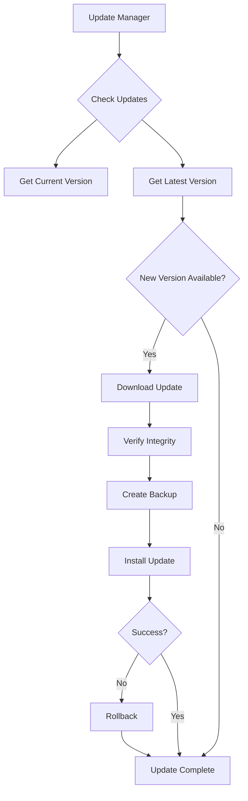

# Photo Editor 2 Unified Update Manager

This project implements a comprehensive update management system for the Photo Editor 2 application, designed to provide secure and automatic updates with rollback capabilities.

## Features Implemented

### 1. Version Management
- Read current version from `version.txt`
- Compare versions using semantic versioning logic
- Support for complex version schemes (e.g., 2.10.5 vs 2.9.10)

### 2. Update Discovery & Download
- Fetch latest releases from GitHub API
- Automatically detect platform and architecture
- Download platform-specific assets (detection logic)
- Support for generic or platform-specific update files

### 3. Security Features
- File integrity verification with SHA256 hashes
- GPG signature verification for releases
- Automated key management within the application directory

### 4. Installation & Rollback
- Automatic backup creation before installation
- Package extraction (ZIP and TAR formats supported)
- Rollback capability in case of installation failure
- Version file update post-installation

### 5. Background Operations
- Periodic background update checking
- Configurable update intervals
- Daemon thread support for continuous monitoring

### 6. Configuration Management
- JSON configuration file at `config/updater_config.json`
- Support for background updates, auto-install, and update intervals
- GitHub API endpoint customization

## System Design



## Installation

The update manager requires Python 3.6+ and additional libraries:

```bash
pip install requests python-gnupg
```

## Usage

### Basic Operation:
```python
from unified_updater import UnifiedUpdateManager

# Initialize the updater
updater = UnifiedUpdateManager()

# Check for updates without installing
info = updater.check_for_update()
print(f"Update available: {info['update_available']}")

# Perform update automatically (if enabled in config)
result = updater.check_and_update(auto_install=True)

# Start background checking
thread = updater.start_background_update_checker()
```

### Manual Update:
```python
# Download update for current platform
downloaded_file = updater.download_update("1.0.1")

# Install the update with rollback capability
if downloaded_file:
    success = updater.install_update(downloaded_file)
```

## Security Features

### Integrity Verification
- All downloads are verified against SHA256 checksums
- Files must match expected hash values from GitHub releases
- Automatic verification of all binary assets

### Signature Validation
- GPG signature verification for all packages
- Private keys stored securely in `~/.gnupg/` directory
- Automated import of public keys from release signing keys

## Configuration

Configuration file located at `config/updater_config.json`:

```json
{
    "github": {
        "owner": "tomekkrow-sys",
        "repo": "Photo_Editor_2",
        "api_url": "https://api.github.com"
    },
    "update_check_interval": 1800,
    "auto_update": true,
    "background_updates": true
}
```

## Development and Testing

To run the test suite:

```bash
python -m unittest tests/test_unified_updater.py -v
```

Tests cover:
- Version comparison logic
- Configuration loading
- Platform detection
- Checksum calculations
- Backup/restore functionality
- GitHub API integration
- Error handling scenarios

## Requirements

- Python 3.6+
- requests library (`pip install requests`)
- python-gnupg library (`pip install python-gnupg`)

## License

MIT License - see `LICENSE` file for details.